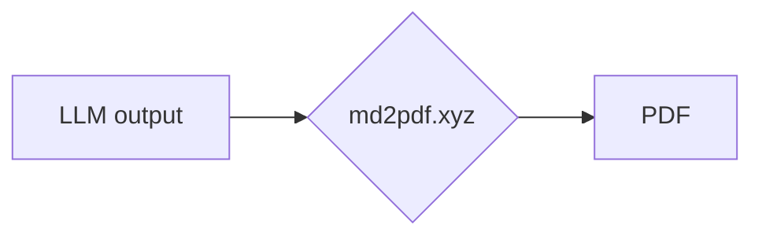

# MD2PDF

> Los LLM escriben en Markdown. Los humanos leen PDFs. MD2PDF es la interfaz.

## **[md2pdf.xyz](https://md2pdf.xyz)** — ábrelo y úsalo ahora mismo. Sin registro. Sin instalación.

[](https://github.com/4i3n6/md2pdf/actions/workflows/ci.yml)
[](https://github.com/4i3n6/md2pdf/releases/latest)
[](LICENSE)
[](tsconfig.json)
[](#privacy)
[](#privacy)
[](#offline-and-pwa)
[](#offline-and-pwa)

---

## La idea

Los LLM modernos — ChatGPT, Claude, Gemini, Perplexity — producen Markdown por defecto. Lo hacen excepcionalmente bien: encabezados estructurados, bloques de código delimitados, tablas, diagramas Mermaid, listas numeradas.

Markdown es un formato de *origen*. Las personas que reciben tu trabajo leen PDFs.

MD2PDF cierra esa brecha. Pega la salida de cualquier LLM, vela renderizada en vivo, exporta un PDF con precisión de píxel en un clic. Ningún servidor ve tu documento. No requiere cuenta. Sin tuberías de conversión. Todo se ejecuta enteramente en tu navegador — y funciona offline después de la primera carga.

```
Salida de LLM (Markdown)  →  md2pdf.xyz  →  PDF
```

---

## Cómo usarlo

**[md2pdf.xyz](https://md2pdf.xyz)** — abre y usa inmediatamente. Nada que instalar.

O auto-hospédalo en menos de un minuto:

```bash
git clone https://github.com/4i3n6/md2pdf.git
cd md2pdf
npm install && npm run dev
```

Abre [http://localhost:3000](http://localhost:3000).

---

## Características

### Editor
- **CodeMirror 6** — resaltado de sintaxis en vivo mientras escribes en 16 lenguajes, incluyendo SQL, TypeScript, Go, Rust, Python.
- **Validación de Markdown en tiempo real** — decoraciones de error en línea mientras escribes, panel de problemas con auto-correcciones en un clic.
- **Barra de herramientas de etiquetas rápidas** — inserción con un solo clic para encabezados, negrita, cursiva, bloques de código, tablas, SQL, YAML, Mermaid, saltos de página y más.
- **Panel dividido redimensionable** — arrastra el divisor, doble clic para restablecer al 50/50, posición persistente entre sesiones.
- **Arrastrar y soltar** — suelta cualquier archivo `.md`, `.sql`, `.yaml`, `.py` u otro; se envuelve automáticamente en el delimitador correcto.

### Documentos
- **Espacio de trabajo multi-documento** — crea, renombra, reordena, elimina; todos los documentos en `localStorage`.
- **Navegación completa por teclado** — teclas de flecha, `Home`/`End`, `Delete`, `Enter` en la lista de documentos; no requiere mouse.
- **Importar / Exportar** — importa archivos `.md` desde el disco, exporta como `.md` sin abrir el diálogo de impresión.
- **Respaldo y restauración** — exportación e importación completa del espacio de trabajo en JSON.

### Renderizado de Markdown
- **GitHub Flavored Markdown** — tablas, listas de tareas, tachado, bloques de código delimitados.
- **Resaltado de sintaxis** — impulsado por highlight.js en más de 30 lenguajes en la vista previa.
- **Diagramas de Mermaid** — diagramas de flujo, secuencia, Gantt, ER, estado, clase, pastel, viaje, gráfico git; carga diferida (lazy-loaded).
- **Procesador YAML** — `js-yaml` renderiza frontmatter de YAML estructurado y bloques de código `yaml` como salida formateada; carga diferida.
- **Saltos de página** — `<!-- pagebreak -->` inserta un salto explícito con un indicador visual en la vista previa.

### Impresión y exportación a PDF
- **Hoja de estilos A4 dedicada** — independiente de los estilos de pantalla; controla márgenes (10mm), fuentes y flujo de página.
- **Liberation Mono** — utilizada para todos los bloques de código en la salida impresa; cobertura correcta de Unicode y caracteres acentuados.
- **Control de tamaño de fuente** — de 6pt a 12pt, configurable por documento, persistente entre sesiones.
- **Fidelidad de impresión de Mermaid** — los diagramas anchos rotan automáticamente a horizontal; saltos de página gestionados por diagrama; etiquetas corregidas para diagramas de clase, estado y ER.
- **Validación pre-vuelo** — verifica bloques de código sin cerrar, errores de diagrama no resueltos y desbordamientos antes de imprimir.
- **Paridad WYSIWYG** — visualización de URL después de eliminar enlaces en la impresión; lo que muestra la vista previa es exactamente lo que se imprime.

### Offline y PWA
- **Service worker offline-first** — totalmente funcional sin conexión a red después de la primera carga.
- **Instalable** — añade al escritorio o pantalla de inicio como una aplicación independiente.
- **Notificaciones de actualización** — solicita recargar cuando se despliega una nueva versión.

### Accesibilidad
- **WCAG 2.1 AA** — HTML semántico, etiquetas ARIA en todos los elementos interactivos, relaciones de contraste conformes en todo el sitio.
- **Operación completa por teclado** — cada acción es alcanzable sin un mouse.
- **Interfaz bilingüe** — Inglés (`/`) y Portugués (`/pt/`).

---

## Comandos

```bash
npm run dev           # servidor de desarrollo en el puerto 3000
npm run build         # build de producción → ./dist
npm run preview       # previsualizar build de producción localmente
npm run typecheck     # tsc --noEmit (debe pasar antes del commit)
npm test              # pruebas unitarias con Vitest
npm run smoke         # prueba de humo contra la build de producción
npm run visual:test   # suite de fidelidad de renderizado/impresión con Playwright
```

---

## Atajos de teclado

### Globales

| Atajo | Acción |
|---|---|
| `Ctrl / Cmd + N` | Nuevo documento |
| `Ctrl / Cmd + S` | Forzar guardado |
| `Ctrl / Cmd + Shift + E` | Exportar PDF |
| `Ctrl / Cmd + Shift + C` | Copiar Markdown al portapapeles |
| `Ctrl / Cmd + Shift + I` | Enfocar lista de documentos desde el editor |
| `Escape` | Salir de la vista previa de impresión |

### Lista de documentos

| Tecla | Acción |
|---|---|
| `↑` / `↓` | Navegar documentos |
| `Home` / `End` | Saltar al primer / último documento |
| `Enter` | Abrir documento seleccionado |
| `Delete` | Eliminar documento seleccionado |

---

## Resaltado de sintaxis

El editor (CodeMirror 6) proporciona resaltado en vivo mientras escribes. Usa estos identificadores después de las triples comillas invertidas iniciales:

| Lenguaje | Identificadores |
|---|---|
| SQL / DDL | `sql` `ddl` `postgres` `psql` |
| JavaScript | `js` `javascript` `jsx` |
| TypeScript | `ts` `typescript` `tsx` |
| Python | `py` `python` |
| Go | `go` |
| Rust | `rs` `rust` |
| Java | `java` |
| C / C++ | `c` `cpp` `h` `hpp` |
| PHP | `php` |
| Ruby | `rb` `ruby` |
| Shell / Bash | `sh` `bash` `shell` |
| CSS | `css` |
| HTML | `html` `htm` |
| XML | `xml` |
| YAML | `yaml` `yml` |
| JSON | `json` |

El renderizador de vista previa usa highlight.js y extiende esta lista a más de 30 lenguajes, incluyendo C#, Swift, Kotlin, Scala, Haskell, Lua, R, Dockerfile, nginx y más.

---

## Diagramas de Mermaid

Todos los tipos de diagramas de Mermaid son compatibles. Usa un bloque de código delimitado por `mermaid`:

~~~markdown

~~~

Tipos compatibles: `flowchart`, `sequenceDiagram`, `gantt`, `erDiagram`, `stateDiagram-v2`, `classDiagram`, `pie`, `journey`, `gitgraph`, `timeline`.

Los diagramas anchos rotan automáticamente a orientación horizontal en la salida impresa. Los saltos de página se gestionan por diagrama para evitar cortes a mitad de la figura.

---

## Saltos de página

Inserta un salto de página explícito en cualquier punto de tu documento:

```markdown
Contenido arriba.

<!-- pagebreak -->

Contenido abajo, en una página nueva.
```

Una línea discontinua marca la posición del salto en la vista previa. Es invisible en pantalla y solo surte efecto al imprimir.

---

## Stack tecnológico

| Capa | Tecnología |
|---|---|
| Build | [Vite](https://vitejs.dev) |
| Lenguaje | TypeScript (modo estricto) |
| Editor | [CodeMirror 6](https://codemirror.net) |
| Markdown | [marked.js](https://marked.js.org) + pipeline personalizado |
| Diagramas | [Mermaid](https://mermaid.js.org) (lazy) |
| Resaltado | [highlight.js](https://highlightjs.org) |
| YAML | [js-yaml](https://github.com/nodeca/js-yaml) (lazy) |
| Almacenamiento | `localStorage` |
| Exportación PDF | `window.print()` + hoja de estilos A4 dedicada |
| Pruebas | [Vitest](https://vitest.dev) + [Playwright](https://playwright.dev) |
| CI | GitHub Actions |
| Asistente AI | [OpenCode](https://github.com/anomalyco/opencode) |

**Arquitectura:** 18 módulos de servicio enfocados — vista previa, flujo de impresión, navegación por teclado, etiquetas rápidas, I/O de documentos, estado de guardado, divisor y más — cada uno con una sola responsabilidad y una interfaz clara. La tubería de impresión se ejecuta en etapas discretas de validar → reportar → imprimir con comprobaciones pre-vuelo contra el DOM de la vista previa en vivo antes de activar el diálogo de impresión.

---

## Despliegue

La salida del build en `./dist` es un sitio estático. Despliégalo en cualquier host estático:

```bash
npm run build
# → servir ./dist
```

La ruta `/app` debe redireccionarse a `app.html`. Se incluye un archivo `_redirects` compatible con Cloudflare Pages en la raíz del repo:

```
/app    /app.html   200
```

---

## Personalización

### Tema

Edita las propiedades personalizadas de CSS en `src/styles.css`:

```css
:root {
    --accent: #0052cc;      /* enlaces, estados activos, anillos de enfoque */
    --success: #007328;     /* estado guardado, sistema en línea */
    --font-mono: 'JetBrains Mono', 'Fira Code', monospace;
}
```

### Contenido predeterminado del documento

Edita `defaultDoc` en `src/services/documentManager.ts`.

---

## Privacidad

Todos los datos — documentos, preferencias, estado del editor — se almacenan exclusivamente en el `localStorage` de tu navegador. Nada se envía a ningún servidor. La aplicación no tiene analíticas, ni telemetría, y no realiza peticiones de red después de la carga inicial de la página.

Tus documentos son tuyos. Nunca salen de tu dispositivo.

---

## Contribuir

Las pull requests son bienvenidas. Para cambios significativos, abre primero un issue para discutir el enfoque.

Consulta [CONTRIBUTING.md](CONTRIBUTING.md) y [CODE_OF_CONDUCT.md](CODE_OF_CONDUCT.md).

---

## Agradecimientos

[OpenCode](https://github.com/anomalyco/opencode) fue una de las herramientas que colaboró en la construcción de este proyecto — encargándose de refactorizaciones, decisiones arquitectónicas y automatización durante el desarrollo.

---

## Licencia

[MIT](LICENSE)
