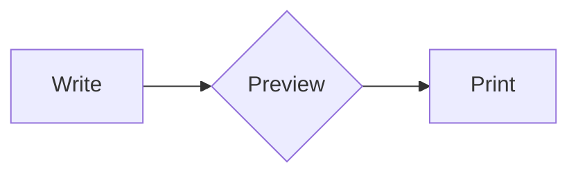

# MD2PDF

> A terminal-flavored Markdown editor that converts documents to precision-printed PDFs — entirely in your browser.

No servers. No uploads. No accounts. Every keystroke stays on your machine.

[](https://github.com/4i3n6/md2pdf/actions/workflows/ci.yml)
[](LICENSE)
[](https://github.com/4i3n6/md2pdf/releases/latest)
[](tsconfig.json)
[](#privacy)
[](#privacy)
[](#offline-and-pwa)
[](#offline-and-pwa)

---

## What it is

MD2PDF is a fully client-side Markdown editor with a live split-pane preview and pixel-accurate PDF export through the browser's native print engine. It was designed around a single hard constraint: **the PDF must look exactly like the preview.**

Documents are stored in `localStorage`. The editor is powered by CodeMirror 6. Diagrams render via Mermaid. PDF generation calls `window.print()` against a purpose-built A4 stylesheet — no PDF library, no wkhtmltopdf, no puppeteer. Just the browser, doing its job.

The UI is deliberately minimal: monospace font throughout, a live metrics bar showing memory, render latency, and system status, a sidebar that shows nothing but what you need.

---

## Features

### Editor
- **CodeMirror 6** — live syntax highlighting while you write in 16 languages including SQL, TypeScript, Go, Rust, Python
- **Real-time Markdown validation** — inline error decorations as you type, problems panel with one-click auto-fixes
- **Quick-tag toolbar** — single-click insertion for headings, bold, italic, code blocks, tables, SQL, YAML, Mermaid, page breaks, and more
- **Resizable split pane** — drag the divider, double-click to reset to 50/50, position persisted across sessions
- **Drag and drop** — drop any `.md`, `.sql`, `.yaml`, `.py`, or other file; auto-wrapped in the correct fence

### Documents
- **Multi-document workspace** — create, rename, reorder, delete; all docs in `localStorage`
- **Full keyboard navigation** — arrow keys, `Home`/`End`, `Delete`, `Enter` in the document list; no mouse required
- **Import / Export** — import `.md` files from disk, export as `.md` without opening the print dialog
- **Backup and restore** — full workspace JSON export and import

### Markdown rendering
- **GitHub Flavored Markdown** — tables, task lists, strikethrough, fenced code blocks
- **Syntax highlighting** — powered by highlight.js across 30+ languages in the preview
- **Mermaid diagrams** — flowcharts, sequence, Gantt, ER, state, class, pie, journey, git graph; lazy-loaded
- **YAML processor** — `js-yaml` renders structured YAML frontmatter and `yaml` code blocks as formatted output; lazy-loaded
- **Page breaks** — `<!-- pagebreak -->` inserts an explicit break with a visual indicator in the preview

### Print and PDF export
- **Dedicated A4 stylesheet** — independent from screen styles; controls margins (10mm), fonts, and page flow
- **Liberation Mono** — used for all code blocks in print output; correct Unicode and accented character coverage
- **Font size control** — 6pt to 12pt, configurable per document, persisted across sessions
- **Mermaid print fidelity** — wide diagrams auto-rotate to landscape; page breaks managed per diagram; labels corrected for class, state, and ER diagrams
- **Pre-flight validation** — checks for unclosed code blocks, unresolved diagram errors, and overflow before printing
- **WYSIWYG parity** — URL display after links removed in print; what the preview shows is exactly what prints

### Offline and PWA
- **Offline-first service worker** — fully functional without a network connection after first load
- **Installable** — add to desktop or home screen as a standalone app
- **Update notifications** — prompts to reload when a new version is deployed

### Accessibility
- **WCAG 2.1 AA** — semantic HTML, ARIA labels on all interactive elements, compliant contrast ratios throughout
- **Full keyboard operation** — every action reachable without a mouse
- **Bilingual UI** — English (`/`) and Portuguese (`/pt/`)

---

## Quick start

```bash
git clone https://github.com/4i3n6/md2pdf.git
cd md2pdf
npm install
npm run dev
```

Open [http://localhost:3000](http://localhost:3000).

---

## Commands

```bash
npm run dev           # dev server on port 3000
npm run build         # production build → ./dist
npm run preview       # preview production build locally
npm run typecheck     # tsc --noEmit (must pass before commit)
npm test              # Vitest unit tests
npm run smoke         # smoke test against production build
npm run visual:test   # Playwright render/print fidelity suite
```

---

## Keyboard shortcuts

### Global

| Shortcut | Action |
|---|---|
| `Ctrl / Cmd + N` | New document |
| `Ctrl / Cmd + S` | Force save |
| `Ctrl / Cmd + Shift + E` | Export PDF |
| `Ctrl / Cmd + Shift + C` | Copy Markdown to clipboard |
| `Ctrl / Cmd + Shift + I` | Focus document list from editor |
| `Escape` | Exit print preview |

### Document list

| Key | Action |
|---|---|
| `↑` / `↓` | Navigate documents |
| `Home` / `End` | Jump to first / last document |
| `Enter` | Open selected document |
| `Delete` | Delete selected document |

---

## Syntax highlighting

The editor (CodeMirror 6) provides live highlighting while you write. Use these identifiers after the opening triple-backtick fence:

| Language | Fence identifiers |
|---|---|
| SQL / DDL | `sql` `ddl` `postgres` `psql` |
| JavaScript | `js` `javascript` `jsx` |
| TypeScript | `ts` `typescript` `tsx` |
| Python | `py` `python` |
| Go | `go` |
| Rust | `rs` `rust` |
| Java | `java` |
| C / C++ | `c` `cpp` `h` `hpp` |
| PHP | `php` |
| Ruby | `rb` `ruby` |
| Shell / Bash | `sh` `bash` `shell` |
| CSS | `css` |
| HTML | `html` `htm` |
| XML | `xml` |
| YAML | `yaml` `yml` |
| JSON | `json` |

The preview renderer uses highlight.js and extends this list to 30+ languages including C#, Swift, Kotlin, Scala, Haskell, Lua, R, Dockerfile, nginx, and more.

---

## Mermaid diagrams

All Mermaid diagram types are supported. Use a `mermaid` fenced code block:

~~~markdown

~~~

Supported types: `flowchart`, `sequenceDiagram`, `gantt`, `erDiagram`, `stateDiagram-v2`, `classDiagram`, `pie`, `journey`, `gitgraph`, `timeline`.

Wide diagrams automatically rotate to landscape orientation in print output. Page breaks are managed per diagram to prevent mid-figure splits.

---

## Page breaks

Insert an explicit page break at any point in your document:

```markdown
Content above.

<!-- pagebreak -->

Content below, on a new page.
```

A dashed line marks the break position in the preview. It is invisible on screen and only takes effect in print.

---

## Tech stack

| Layer | Technology |
|---|---|
| Build | [Vite](https://vitejs.dev) |
| Language | TypeScript (strict mode) |
| Editor | [CodeMirror 6](https://codemirror.net) |
| Markdown | [marked.js](https://marked.js.org) + custom pipeline |
| Diagrams | [Mermaid](https://mermaid.js.org) (lazy) |
| Highlighting | [highlight.js](https://highlightjs.org) |
| YAML | [js-yaml](https://github.com/nodeca/js-yaml) (lazy) |
| Storage | `localStorage` |
| PDF export | `window.print()` + dedicated A4 stylesheet |
| Tests | [Vitest](https://vitest.dev) + [Playwright](https://playwright.dev) |
| CI | GitHub Actions |

**Architecture:** 18 focused service modules — preview, print workflow, keyboard navigation, quick tags, document I/O, save status, splitter, and more — each with single responsibility and a clear interface. The print pipeline runs in discrete validate → report → print stages with pre-flight checks against the live preview DOM before triggering the print dialog.

---

## Deployment

The build output in `./dist` is a static site. Deploy to any static host:

```bash
npm run build
# → serve ./dist
```

The route `/app` must rewrite to `app.html`. A `_redirects` file compatible with Cloudflare Pages is included at the repo root:

```
/app    /app.html   200
```

---

## Customization

### Theme

Edit CSS custom properties in `src/styles.css`:

```css
:root {
    --accent: #0052cc;      /* links, active states, focus rings */
    --success: #007328;     /* saved status, system online */
    --font-mono: 'JetBrains Mono', 'Fira Code', monospace;
}
```

### Default document content

Edit `defaultDoc` in `src/services/documentManager.ts`.

---

## Privacy

All data — documents, preferences, editor state — is stored exclusively in your browser's `localStorage`. Nothing is sent to any server. The application has no analytics, no telemetry, and no network requests after the initial page load.

---

## Contributing

Pull requests are welcome. For significant changes, open an issue first to discuss the approach.

See [CONTRIBUTING.md](CONTRIBUTING.md) and [CODE_OF_CONDUCT.md](CODE_OF_CONDUCT.md).

---

## License

[MIT](LICENSE)
