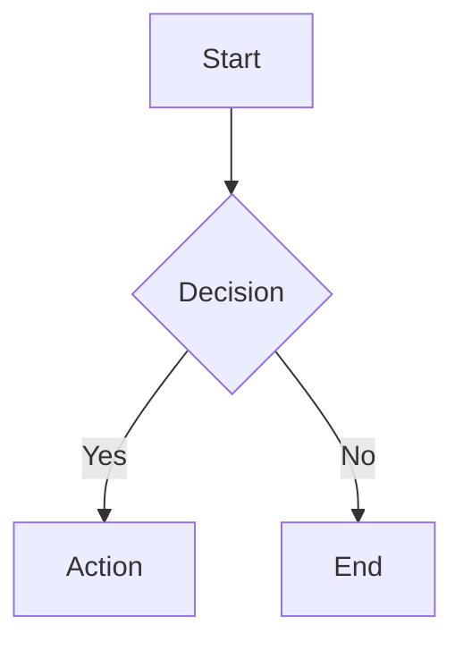

# QA Checklist (Regressao) - MD2PDF

Objetivo: validar que a refatoracao nao removeu funcionalidades nem quebrou fluxos essenciais.

## Checks de build (obrigatorios)
- `npm run build`
- `npm run typecheck`
- `npm run smoke`

## Checks manuais (funcionais)
1. App carrega e inicializa
- Abrir `/app` (ou `/pt/app`) e confirmar:
  - Editor aparece
  - Preview renderiza
  - Logs do sistema aparecem
  - Metric de MEM atualiza

2. Documentos (CRUD)
- Criar novo documento (`+` ou `Ctrl/Cmd+N`)
- Renomear documento no campo "Nome do documento"
- Alternar entre documentos (lista lateral)
- Deletar documento NAO-ativo e validar que some da lista
- Deletar documento ATIVO e validar:
  - App troca para outro documento automaticamente
  - Editor/preview atualizam corretamente

3. Salvamento
- Digitar no editor e validar que o status muda para "Nao salvo"
- Esperar o autosave e validar que volta para "Salvo ha ..."
- Forcar salvamento (`Ctrl/Cmd+S`) e validar log de sucesso

4. Import/Export Markdown
- `IMPORT MD`: importar um `.md` e validar que vira um doc novo e abre automaticamente
- `EXPORT MD`: baixar o doc atual e validar conteudo

5. Backup/Restore
- `BACKUP ALL`: gerar arquivo de backup
- Modificar/criar docs
- `RESTORE`: restaurar backup e validar que substitui tudo (com confirmacao)

6. Preview (renderizacao)
- Markdown basico (heading/listas/links/tabelas)
- Bloco de codigo com linguagem (ex: ` ```js `) com highlight
- `<!-- pagebreak -->` gera quebra visual no preview

7. Mermaid/YAML (lazy)
- Mermaid:

- YAML:
```yaml
app:
  name: md2pdf
  features:
    - preview
    - print
```

8. Imagens (otimizacao A4)
- Inserir imagem remota: `` e validar que o preview processa sem quebrar.

9. Impressao / Export PDF
- Clicar `[ EXP_PDF ]` e validar:
  - Pre-check aparece no log (warnings se existirem)
  - Dialogo de impressao abre
  - Ao fechar, UI restaura e continua funcional
- Preview de impressao: `Ctrl/Cmd+Shift+P` liga/desliga (ESC sai)

10. Splitter
- Arrastar o divisor, recarregar a pagina e validar que o ratio foi persistido
- Duplo clique no divisor reseta para 50/50

11. Offline
- Desligar rede e validar status OFFLINE
- Voltar rede e validar status ONLINE + log de "Conexao restaurada"

12. PWA
- Em build de producao, validar existencia de SW/manifest e que o app funciona offline (quando possivel).

